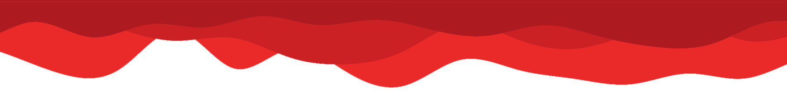
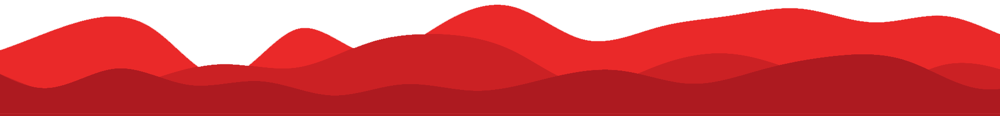

# Mi Portafolio 🏅 
Mi portafolio web se basa en mostrar mis **trabajos** y mis **habilidades** como **desarrollador frontend**, donde muestro los **proyectos** en los que he trabajado. También nombro las **tecnologías y herramientas** que sé usar, mi **educación** como desarrollador frontend o en un campo relacionado. Por último, indico dónde podrían **contactarme** para discutir oportunidades de trabajo.

| Funcionalidad | Descripcion |
| --- | ---|
| Modo Dark | Permite al usuario cambiar la apariencia visual de un tema claro a un tema oscuro, y asegúra de que las preferencias del usuario se guarden adecuadamente. |
| Boton de inicio | Al desplazarnos hacia abajo en la página utilizando este botón, regresaremos al inicio de manera rápida y sencilla. |
| Atajos de teclado | En la sección de habilidades, al abrir la ventana de información, podemos cerrarla fácilmente utilizando la tecla ESCAPE. Del mismo modo, en el campo de búsqueda del perfil en GitHud, también podemos cerrarlo. Además, podemos utilizar la tecla ENTER para buscar de manera rápida, como tambien poder mover hacia la derecha o izquierda el slider de los proyectos con las flechas |
| Diseño responsivo | La página se ajusta de manera óptima a cualquier tamaño de pantalla, garantizando una experiencia de visualización perfecta en todos los dispositivos. |
| Menu de navegacion | Mediante este menú, los usuarios pueden acceder rápidamente a las secciones de la página que les interesan. En el pantalla movil o de tableta, el menú se oculta, pero se puede desplegar utilizando el botón de menú.

## Seccion - Sobre mi 👋

En esta sección, proporciono un resumen conciso de mi **experiencia profesional**, **formación académica** y las **tecnologías** que he adquirido. Adyacente a este resumen, se encuentra un bloque dedicado a las **habilidades que he dominado**. Al seleccionar cada habilidad, se despliega una **ventana con información** detallada sobre su aplicación. Además, se incluye un enlace que redirige a la **página oficial** correspondiente para cada habilidad.

## Seccion - Proyectos 📑

Esta sección es de vital importancia, ya que en ella exhibo todos los **proyectos** que he realizado. La información presentada se obtiene directamente de mi cuenta en **GitHub** mediante su **API**. Un aspecto destacado de esta sección es que los proyectos se cargan desde Git Hub, lo que significa que **cualquier persona** puede buscar sus propios proyectos desde aquí. Esta funcionalidad permite cargar sus repositorios junto con su nombre, descripcion y topics; sus seguidores, su nombre, la descripcion que tiene en su cuenta de Git Hub

Para el **correcto funcionamiento** de la búsqueda, es esencial que el usuario tenga su cuenta de GitHub adecuadamente configurada. Esto implica que la cuenta debe contener una **descripción detallada**, al igual que cada uno de los repositorios. Además, es importante incluir los **‘topics’** correspondientes y, si se tiene vinculada, **enlaces** a su pagina de cada repositorio.

## Seccion - Contacto 🤝

Por último, en la página contamos con un **mapa interactivo** que muestra mi ubicación, todo esto se carga utilizando la **API de Leaflet**. En el primer bloque, ofrecezco la opción de descargar mi **currículum** en formato PDF. Por otro lado, se encuentra un **formulario** de contacto donde los usuarios pueden comunicarse directamente conmigo a través de mi correo electrónico. El formulario solicita información como el nombre, correo electrónico y un mensaje que deseen enviarme. Para esta funcionalidad, se utiliza la **API de FormSubmit**.

## Leonardo Portilla ❤️
Desarrollador Frontend 🔥| HTML, CSS, SASS, JAVASCRIPT

